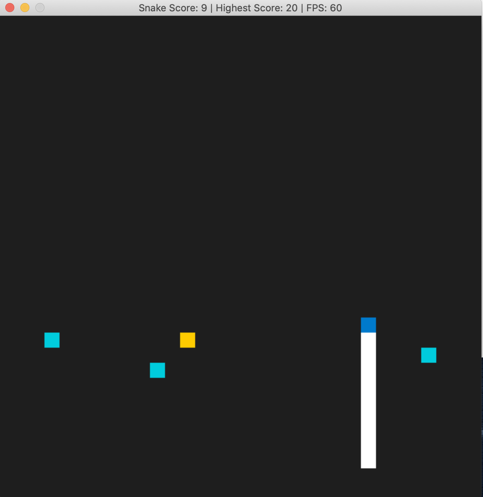
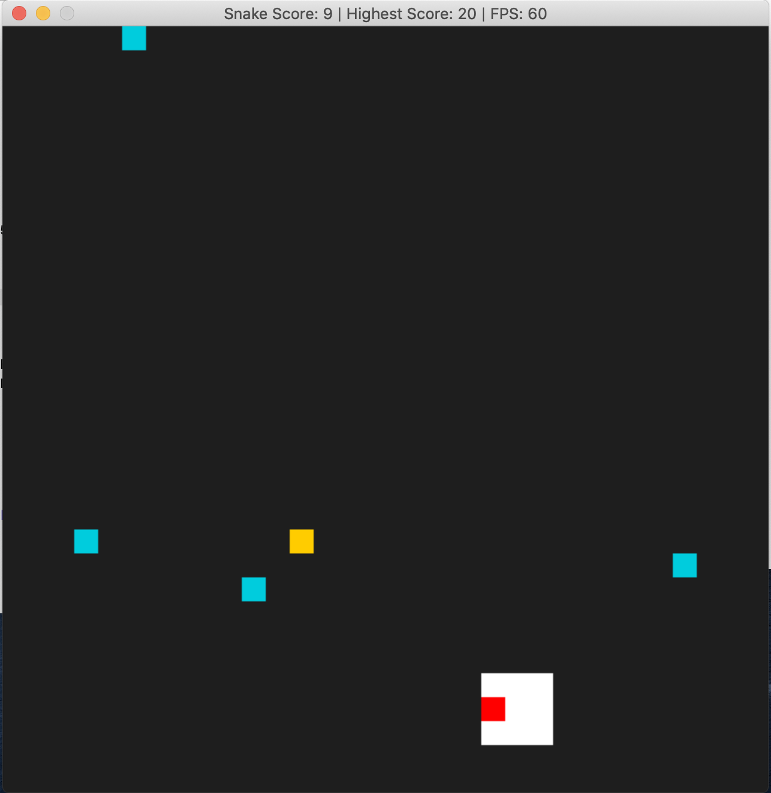

# CPPND: Capstone Snake Game 

I chose the Snake Game as Capstone project in the [Udacity C++ Nanodegree Program](https://www.udacity.com/course/c-plus-plus-nanodegree--nd213). The code for this repo was inspired by [this](https://codereview.stackexchange.com/questions/212296/snake-game-in-c-with-sdl) excellent StackOverflow post and set of responses.

In this project, I extended this Snake game, following the principles I have learned throughout this Nanodegree Program.

## Dependencies for Running Locally
* cmake >= 3.7
  * All OSes: [click here for installation instructions](https://cmake.org/install/)
* make >= 4.1 (Linux, Mac), 3.81 (Windows)
  * Linux: make is installed by default on most Linux distros
  * Mac: [install Xcode command line tools to get make](https://developer.apple.com/xcode/features/)
  * Windows: [Click here for installation instructions](http://gnuwin32.sourceforge.net/packages/make.htm)
* SDL2 >= 2.0
  * All installation instructions can be found [here](https://wiki.libsdl.org/Installation)
  * Note that for Linux, an `apt` or `apt-get` installation is preferred to building from source.
* gcc/g++ >= 5.4
  * Linux: gcc / g++ is installed by default on most Linux distros
  * Mac: same deal as make - [install Xcode command line tools](https://developer.apple.com/xcode/features/)
  * Windows: recommend using [MinGW](http://www.mingw.org/)

## Basic Build Instructions

1. Clone this repo.
2. Make a build directory in the top level directory: `mkdir build && cd build`
3. Compile: `cmake .. && make`
4. Run it: `./SnakeGame`.

## Additional features to the stater code
* Addition of obstacles every 8 seconds to make the game more interesting.
* Logs of highest score.
* Unique pointer for render and window.
* Mux for avoiding data races.

## Rubric Criteria accomplished
* A README with instructions is included with the project.
* The project demonstrates an understanding of C++ functions and control structures.
* The project reads data from a file and process the data, or the program writes data to a file.
* The project uses Object Oriented Programming techniques.
* Classes use appropriate access specifiers for class members.
* The project makes use of references in function declarations.
* The project uses smart pointers instead of raw pointers.
* The project uses multithreading.
* A mutex or lock is used in the project.